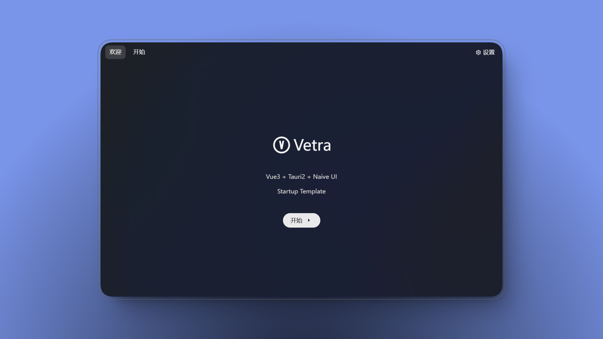
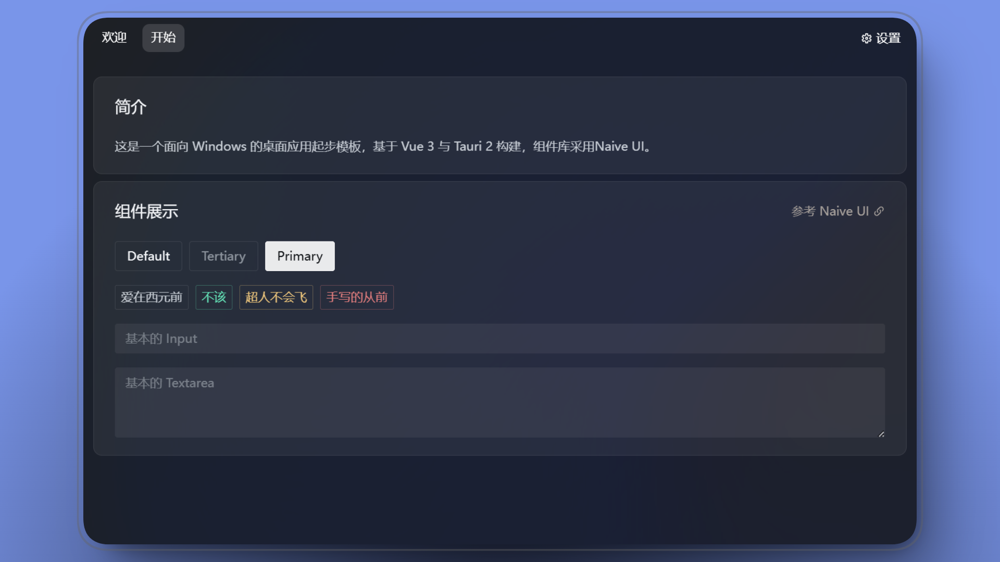
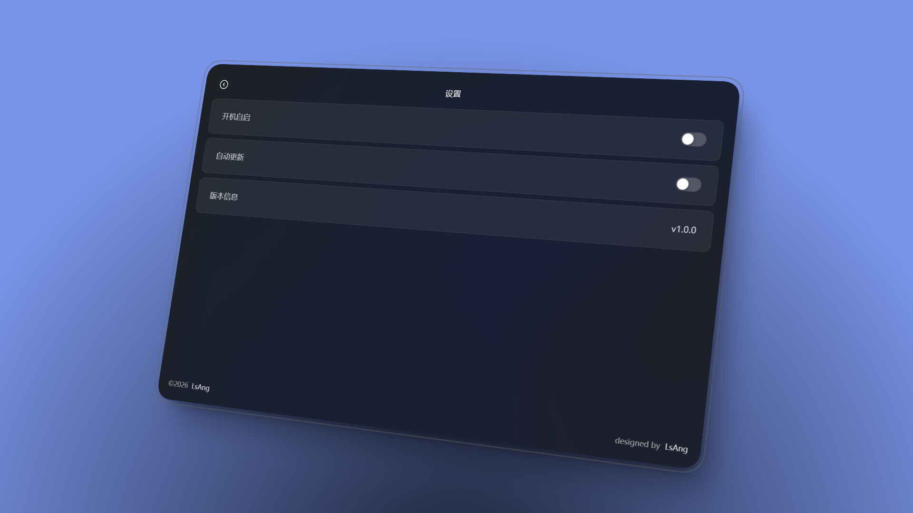

# Vetra

[简体中文](./README.md) | English

A minimal Windows desktop app template built with Vue 3, Tauri 2, Naive UI, and UnoCSS, with a transparent window, dark UI, and Windows 11 Mica style by default.

## Screenshots





## Stack

- Vue 3 + TypeScript + Vite
- Tauri 2 + Rust
- Naive UI
- UnoCSS

## Development

```bash
# install dependencies
pnpm i
# start
pnpm run windows:dev
# build
pnpm run windows:build
# lint
pnpm run lint
```

## Page Route Meta

```vue
<route lang="json5">
{
  name: 'Welcome', // route name
  meta: {
    layout: 'main', // layout used by the page
    isTab: true, // show in the top tabs
    tabsName: 'Welcome', // text shown in the tabs
    tabOrder: 1, // tab order
  },
}
</route>
```
